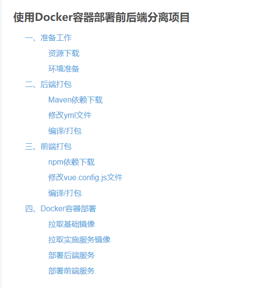

# 使用 Docker 容器部署前后端分离项目

[转载传送门](https://blog.csdn.net/liyns/article/details/107080020)



## 一、准备工作

### `资源下载`

资源地址：

### `环境准备`

- JDK >= 1.8
- MySQL >= 5.7
- Redis >= 3.0
- Maven >= 3.0
- Node >= 10

## 二、后端打包

### `Maven依赖下载`

- 1、用 IDEA 导入工程项目
- 2、在左上角的工具栏选择 File ，然后在下拉列表点击 Settings
- 3、搜索 Maven，把本地仓库的路径配置好，Settings.xml 文件的路径也指定一下，但前提是里面必须配置阿里云中央镜像，其实在 pom.xml 已经配置好了，这里我没有使用 pom.xml 指向的阿里云镜像

### `修改yml文件`

- 1、在项目的 resources 目录找到 application.yml 文件
- 2、由于我们的项目最终是放在 Centos7 系统里面，所以我们就默认选定这个地址
- 3、端口号我们也是用默认就好了，除非端口号没有被占用的情况下可以选择默认的
- 4、配置 Redis 的 password，host 默认就行了，后面会跟大家讲为什么不配置 host
- 5、在项目的 resources 目录找到 application-druid.yml 文件
- 6、配置 MySQL 数据源，重点是 url 划线部分，这个使用默认就好了，后面会讲到，在这里我们就单纯的配置一下 password 就行了

### `编译/打包`

- 1、先 clean 清空缓存，然后在 install 编译/打包
- 2、在项目下找到 target 目录，然后右键 rouyi.jar 文件选择 File Path
- 3、把 rouyi.jar 文件拷贝到画框框的目录下

## 三、前端打包

### `npm依赖下载`

- 1、用 vscode 导入工程项目
- 2、在 Windows 搜索框里输入 cmd 命令窗口，并以管理员身份运行
- 3、复制 ruoyi-ui 目录路径，并用命令切换到 ruoyi-ui 目录
- 4、如果没有安装 python2.7 环境则需要安装，因为 node-gyp 只依赖 python2.7，所以继续在 Windows 命令窗口输入 npm install --global --production windows-build-tools 和 npm install --global node-gyp 命令
- 5、先找到 python27 目录，然后在系统环境变量配置变量名 PYTHON，变量值 C:\Users\你自己的 Windows 登录名\ .windows-build-tools\python27
- 6、打开另外一个命令窗口输入 python 指令看一下是否安装成功，如果有显示以下信息就表示环境变量设置成功
- 7、python 环境变量设置成功之后，我们就可以正式的下载依赖库，在之前第一个命令窗口继续输入 npm install 命令

### `修改vue.config.js文件`

- 1、在项目下找到 vue.config.js 文件，修改后端的 API 端口，如果后端采用默认的端口，那么前端就不需要修改了

### `编译/打包`

- 1、继续在第一个命令窗口输入 npm run build:prod (依照自己前端项目的打包命令)
- 2、将 dist 文件夹下的全部内容拷贝到\ruoyi-develop\docker\project\ruoyi-ui 目录下

## 四、Docker 容器部署

### `拉取基础镜像`

- 1、用 xshell 命令远程连接 Ubuntu16.04 系统(由于我是在阿里云买了服务，所以我没有在虚拟机下载 Ubuntu16.04 系统，而是直接用阿里云的，阿里云会默认开放 22 端口号，这里需要设置一下)
- 2、把 docker 目录放到 Ubuntu16.04 系统的 root 目录下
- 3、在 xshell 依次输入以下命令
  ```js
  1.更新apt软件包索引
  sudo apt-get update
  2.安装系统自带版本Docker
  apt-get install -y docker.io
  3.构建基础镜像Centos7，进入到/root/docker/base/centos7目录下输入以下命令
  docker build -t ruoyi/centos7-ssh .
  4.构建基础镜像JDK，进入到/root/docker/base/jdk8u151目录下输入以下命令
  docker build -t ruoyi/centos7-jdk8u151 .
  5.构建基础镜像Tomcat，进入到/root/docker/base/tomcat7目录下输入以下命令
  docker build -t ruoyi/centos7-tomcat7 .
  ```

### `拉取实时服务镜像`

- 1、进入到 /root/docker/server/Redis/etc 目录下打开 redis.conf 配置文件，找到 requirepass 键值来修改 Redis 密码
- 2、进入到 /root/docker/server/Tengine 目录下打开 nginx.conf 配置文件，并修改后端 API 端口
- 3、继续在 xshell 依次输入以下命令
  ```js
  1.创建网络
  docker network create --subnet=192.168.10.0/24 ruoyi
  2.下载docker-compose
  apt install -y docker-compose
  3.进入到/root/docker/server目录输入以下命令
  docker-compose up -d
  ```
- 4、如果在阿里云部署则要开放端口号，如果本地的虚拟机部署的则要关闭防火墙，这里演示的是阿里云，把刚才构建容器的端口都开放出去
- 5、在页面上输入 你自己的 ip:9010 地址，设置用户名和密码，并选择 local 本地运行
- 6、进入到 MySQL 容器里
- 7、输入以下命令
  ```js
  1.进入MySQL服务
  mysql -uroot -p
  use mysql;
  2.修改MySQL密码
  update user set password = password(“123456”) where user = ‘root’;
  3.开启远程访问
  grant all privileges on . to root@’%’ identified by ‘123456’ with grant option;
  ```
- 8、用 SQLyang 或 Navicat Premium 图形界面工具来连接 MySQL 服务，创建 ry-vue 数据库，最后把 quartz.sql 和 ry_20200415.sql 文件导入到 ry-vue 数据库

### `部署后端服务`

- 1、进入到 /root/docker/project 目录下打开 docker-compose.yml 配置文件，并配置后端 API 端口，左边是宿主机端口(也是就 Ubuntu16.04 系统上的端口)，右边是容器内部端口(也就是拉取基础的镜像的 Centos7 系统)
- 2、进入到 /root/docker/project 输入以下命令
  ```js
  docker-compose up -d
  ```

### `部署前端服务`

- 1、进入到 Tengine 容器
- 2、在 home 目录下创建 ruoyi，然后在 ruoyi 目录下创建 projects 目录
  ```js
  1.进入home目录
  cd /home
  2.在home目录下创建ruoyi
  mkdir ruoyi
  3.进入ruoyi目录
  cd ruoyi
  4.在ruoyi目录下创建projects
  mkdir projects
  ```
- 3、在 xshell 窗口查看 Tengine 容器的 id 或名称，在宿主机拷贝 /root/docker/project/ruoyi-ui 目录，然后在容器拷贝 /home/ruoyi/projects/ 目录，最后输入以下命令
  ```js
  docker cp /root/docker/project/ruoyi-ui server_tengine_l:/home/ruoyi/projects/
  ```
