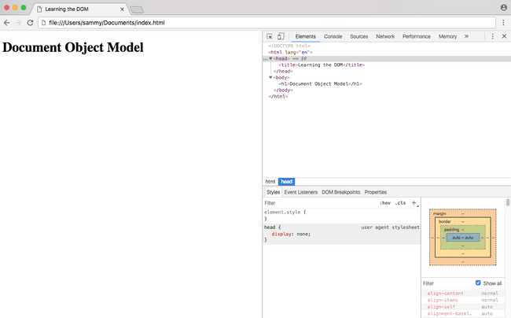

# DOM 简介

[如何使用 JavaScript 编码](https://www.digitalocean.com/community/tutorial_series/how-to-code-in-javascript)

## 介绍

文档对象模型，通常被称为 DOM，是使网站交互的一个重要部分。它是一个界面，允许使用编程语言来操纵网站的内容，结构和样式。JavaScript 是客户端脚本语言，可在 Internet 浏览器中连接到 DOM。

网站几乎每次执行操作时，例如在图像的幻灯片之间旋转，在用户尝试提交不完整的表单时显示错误或切换导航菜单，都是 JavaScript 访问和操作 DOM 的结果。

那么，DOM 是什么，如何使用该 document 对象以及 HTML 源代码和 DOM 之间的区别？

## 什么是 DOM？

在最基本的级别上，网站由 HTML 文档组成。用于查看网站的浏览器是一个程序，该程序解释 HTML 和 CSS，并将样式，内容和结构呈现到您所看到的页面中。

浏览器除了解析 HTML 和 CSS 的样式和结构外，还创建文档的表示形式，称为文档对象模型。这个模型允许 JavaScript 访问文本内容和网站的内容文件的对象。

JavaScript 是一种交互式语言，通过这样做，更容易理解新概念。让我们创建一个非常简单的网站。创建一个 index.html 并将其保存在新的项目目录中。

```js
  <!DOCTYPE html>
  <html lang="en">
    <head>
      <title>Learning the DOM</title>
    </head>

    <body>
      <h1>Document Object Model</h1>
    </body>
  </html>
```

使用您选择的浏览器打开 index.html。您会看到一个普通的网站，其标题显示“文档对象模型”。右键单击页面上的任意位置，然后选择“检查”。这将打开开发人员工具。

在“元素”选项卡下，您将看到 DOM。


在这种情况下，它看起来与我们刚编写的 HTML 源代码完全相同-doctype，以及我们添加的其他一些 HTML 标签。将鼠标悬停在每个元素上将突出显示渲染网站中的相应元素。HTML 元素左侧的小箭头允许您切换嵌套元素的视图。

## DOM 和 HTML 源代码之间有什么区别？

当前，在此示例中，似乎 HTML 源代码和 DOM 完全相同。在两种情况下，浏览器生成的 DOM 将不同于 HTML 源代码：

- DOM 由客户端 JavaScript 修改
- 浏览器会自动修复源代码中的错误

  ```js
  document.body.style.backgroundColor = "fuchsia";
  ```

> `注意：为了更改background-colorCSS属性，我们必须输入backgroundColorJavaScript。任何带连字符的CSS属性都将使用JavaScript用camelCase编写。`

现在，我们输入的 JavaScript 代码（分配 fuchsia 给的背景颜色 body）已成为 DOM 的一部分。

但是，右键单击该页面，然后选择“查看页面源代码”。您会注意到，网站的源代码不包含我们通过 JavaScript 添加的新样式属性。网站的来源不会改变，也不会受到客户端 JavaScript 的影响。如果刷新页面，我们在控制台中添加的新代码将消失。

当源代码中有错误时，DOM 可能具有与 HTML 源代码不同的输出的另一个实例。一个常见的例子是 table 标记-tbody 标记是必需的 table，但是开发人员常常无法将其包含在 HTML 中。浏览器将自动更正错误并添加 tbody，修改 DOM。DOM 还可以修复尚未关闭的标签。
