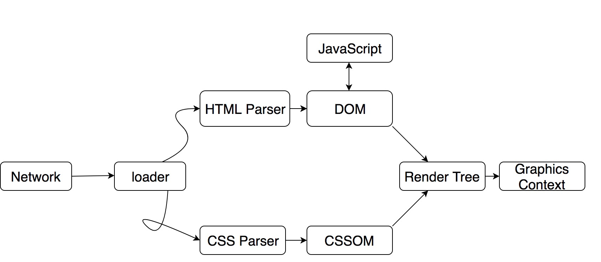

# 一、背景

动态化作为移动客户端的一个重要分支，一直是业界积极探索的方向。
目前业界流行的动态化方案，如 facebook 的 React Native，阿里巴巴的 Weex 都是采用了前端系的 DSL 方案，而他们在 IOS 系统上能够顺利运行，都离不开一个背后的功臣：JavaScriptCore（以下简称 JSCore），它建立起了 Object-C（以下简称 OC）和 JavaScript（以下简称 JS）两门语言之间的沟通桥梁。无论是这些流行的动态化方案，还是 WebView Hybird 方案，亦或是之前广泛流行的 JSPath，JSCore 都在其中发挥了举足轻重的作用。JSCore 也成了开发 IOS 相关的工程师必备的技能之一。

# 二、从浏览器谈起

在 iOS 7 之后，JSCore 作为一个系统级 Framework 被苹果提供给开发者。JSCore 作为苹果的浏览器引擎 WebKit 中重要组成部分，这个 JS 引擎已经存在多年。如果想去追本溯源，探究 JSCore 的奥秘，那么就应该从 JS 这门语言的诞生，以及它最重要的宿主-Safari 浏览器开始谈起。

# 三、JavaScript 历史简介

JavaScript 诞生于 1995 年（和本人同一年诶嘿嘿），它的设计者是 Netscape 的 Brenden Eich，此时的浏览器市场霸主正是 NetScape。

而二十多年前，当时人们在浏览网页的体验极差，因为那会儿的浏览器几乎只有页面的展示能力，没有和用户的交互逻辑处理能力。所以即使一个必填输入框传空，也需要经过服务端验证，等到返回结果之后才给出响应，再加上当时的网速很慢，可能半分钟过去了，返回的结果是告诉你某个必填字段未填。所以 Brendan 花了十天写出了 JavaScript，由浏览器解释执行，从此之后浏览器也有了一些基本的交互处理能力，以及表单数据验证能力。

而 Brendan 可能没有想到，在二十多年后的今天。JS 这门解释执行的动态脚本语言，不光成为前端届的“正统”，还入侵了后端开发领域，在编程语言排行榜上进入前三甲，仅次于 Python 和 Java。而如何解释执行 JS，则是各家引擎的核心技术。目前市面上比较常见的 JS 引擎有 Google 的 V8（它被运用在 Android 操作系统以及 Google 的 Chrome 上），以及我们今天的主角–JSCore（它被运用在 iOS 操作系统以及 Safari 上）。

# 四、Webkit

我们每天都会接触浏览器，使用浏览器工作、娱乐。让浏览器正常工作最核心的部分就是浏览器的内核，每个浏览器都有自己的内核，Safari 的内核就是 Webkit。Webkit 诞生于 1998 年，并于 2005 年由 Apple 公司开源。**Google 的 Blink 也是在 Webkit 的分支上进行开发的。**

Webkit 由很多个重要的模块组成，通过下图我们可以对 Webkit 有个整体的了解：


简单点说就是，Webkit 就是一个页面渲染以及逻辑处理引擎，前端工程师把 HTML、JS、CSS 这“三驾马车”作为输入，经过 Webkit 处理，就输出成了我们能看到的以及能操作的 Web 页面。从上图我们可以看出，webkit 由图中框住的四大部分组成。而其中最主要的就是 WebCore 和 JSCore（或者是其他的 JS 引擎），这两部分下面再细细讲述。除此之外，Webkit Embedding API 是负责浏览器 UI 与 Webkit 进行交互的部分，而 Webkit Ports 则是让 Webkit 更加方便的移植到各个操作系统、平台上，提供的一些调用 Native Library 的接口，比如在渲染层面，在 IOS 系统中，Safari 是交给 CoreGraphics 处理，而在 Android 系统中，Webkit 则是交给 Skia。

# 五、WebCore

在上面的 WebKit 组成图中，我们可以发现只有 WebCore 是红色的。这是因为时至今日,WebKit 已经有很多的分支以及各大厂家也进行了很多优化改造，唯独 WebCore 这个部分是所有 WebKit 共享的。WebCore 是 WebKit 中代码最多的部分，也是整个 WebKit 中最核心的渲染引擎。那首先我们来看看整个 WebKit 的渲染流程：



首先浏览器通过 URL 定位到了一堆由 HTML、CSS、JS 组成的资源文件，通过加载器（这个加载器的实现也很复杂，在此不多赘述）把资源文件给 WebCore。之后 HTML Parser 会把 HTML 解析成 DOM 树，CSS Parser 会把 CSS 解析成 CSSOM 树。最后把这两棵树合并，生成最终需要的渲染树，再经过布局，与具体 WebKit Ports 的渲染接口，把渲染树渲染输出到屏幕上，成为了最终呈现在用户面前的 Web 页面。

# 六、JSCore

## 1、概述

主角 – JSCore。JSCore 是 WebKit 默认内嵌的 JS 引擎，之所以说是默认内嵌，是因为很多基于 WebKit 分支开发的浏览器引擎都开发了自家的 JS 引擎，其中最出名的就是 Chrome 的 V8。这些 JS 引擎的使命都相同，那就是解释执行 JS 脚本。而从上面的渲染流程图我们可以看到，JS 和 DOM 树之间存在着互相关联，这是因为浏览器中的 JS 脚本最主要的功能就是操作 DOM 树，并与之交互。同样的，我们也通过一张图看下它的工作流程:


可以看到，相比静态编译语言生成语法树之后，还需要进行链接，装载生成可执行文件等操作，解释型语言在流程上要简化很多。这张流程图右边画框的部分就是 JSCore 的组成部分：Lexer、Parser、LLInt 以及 JIT 的部分（之所以 JIT 的部分是用橙色标注，是因为并不是所有的 JSCore 中都有 JIT 部分）。接下来我们就搭配整个工作流程介绍每一部分，它主要分为以下三个部分：词法分析、语法分析以及解释执行。

PS：严格的讲，语言本身并不存在编译型或者是解释型，因为语言只是一些抽象的定义与约束，并不要求具体的实现，执行方式。这里讲 JS 是一门“解释型语言”只是 JS 一般是被 JS 引擎动态解释执行，而并不是语言本身的属性。

## 2、词法分析-Lexer

词法分析很好理解，就是把一段我们写的源代码分解成 Token 序列的过程，这一过程也叫分词。在 JSCore，词法分析是由 Lexer 来完成（有的编译器或者解释器把分词叫做 Scanner）。

这是一句很简单的 C 语言表达式：

```js
sum = 1 + 2;
```

将其标记化之后得到：

| 元素 | 标记类型   |
| :--- | :--------- |
| sum  | 标识符     |
| =    | 赋值操作符 |
| 1    | 数字       |
| +    | 加法操作符 |
| 2    | 数字       |
| ;    | 语句结束   |

这就是词法分析之后的结果，但是词法分析并不会关注每个 Token 之间的关系，是否匹配，仅仅是把它们区分开来，等待语法分析来把这些 Token“串起来”。词法分析函数一般是由语法分析器（Parser）来进行调用的。在 JSCore 中，词法分析器 Lexer 的代码主要集中在 parser/Lexer.h、Lexer.cpp 中。

## 3、语法分析-Parser

跟人类语言一样，我们讲话的时候其实是按照约定俗成，交流习惯按照一定的语法讲出一个又一个词语。那类比到计算机语言，计算机要理解一门计算机语言，也要理解一个语句的语法。例如以下一段 JS 语句：

```js
var sum = 1 + 2;
var a = sum + 3;
```

Parser 会把 Lexer 分析之后生成的 token 序列进行语法分析，并生成对应的一棵抽象语法树(AST)。这个树长什么样呢？在这里推荐一个网站：esprima Parser，输入 JS 语句可以立马生成我们所需的 AST。例如，以上语句就被生成这样的一棵树：


之后，ByteCodeGenerator 会根据 AST 来生成 JSCore 的字节码，完成整个语法解析步骤。

## 4、解释执行-LLInt 和 JIT

JS 源代码经过了词法分析和语法分析这两个步骤，转成了字节码，其实就是经过任何一门程序语言必经的步骤–编译。但是不同于我们编译运行 OC 代码，JS 编译结束之后，并不会生成存放在内存或者硬盘之中的目标代码或可执行文件。生成的指令字节码，会被立即被 JSCore 这台虚拟机进行逐行解释执行。

运行指令字节码（ByteCode）是 JS 引擎中很核心的部分，各家 JS 引擎的优化也主要集中于此。JSByteCode 的解释执行是一套很复杂的系统，特别是加入了 OSR 和多级 JIT 技术之后，整个解释执行变的越来越高效，并且让整个 ByteCode 的执行在低延时之间和高吞吐之间有个很好的平衡：由低延时的 LLInt 来解释执行 ByteCode，当遇到多次重复调用或者是递归，循环等条件会通过 OSR 切换成 JIT 进行解释执行（根据具体触发条件会进入不同的 JIT 进行动态解释）来加快速度。由于这部分内容较为复杂，而且不是本文重点，故只做简单介绍，不做深入的讨论。

## #基于寄存器的指令集结构

...后续补充

## #单线程机制

...后续补充

## #事件驱动机制

...后续补充

# 七、iOS 中的 JSCore

> iOS7 之后，苹果对 WebKit 中的 JSCore 进行了 Objective-C 的封装，并提供给所有的 iOS 开发者。JSCore 框架给 Swift、OC 以及 C 语言编写的 App 提供了调用 JS 程序的能力。同时我们也可以使用 JSCore 往 JS 环境中去插入一些自定义对象。

iOS 中可以使用 JSCore 的地方有多处，比如封装在 UIWebView 中的 JSCore，封装在 WKWebView 中的 JSCore，以及系统提供的 JSCore。实际上，即使同为 JSCore，它们之间也存在很多区别。因为随着 JS 这门语言的发展，JS 的宿主越来越多，有各种各样的浏览器，甚至是常见于服务端的 Node.js（基于 V8 运行）。随时使用场景的不同，以及 WebKit 团队自身不停的优化，JSCore 逐渐分化出不同的版本。除了老版本的 JSCore，还有 2008 年宣布的运行在 Safari、WKWebView 中的 Nitro（SquirrelFish）等等。而此处我们主要介绍 iOS 系统自带的 JSCore Framework。

[iOS 官方文档](https://developer.apple.com/documentation/javascriptcore?language=objc)对于 JSCore 的介绍比较简单，主要就是给 App 提供调用 JS 脚本的能力。


**其中很有必要了解的概念有 4 个：JSVM、JSContext、JSValue、JSExport**

## # JSVirtualMachine

## # JSContext

## # JSValue

## # JSExport

[后续补充](https://tech.meituan.com/2018/08/23/deep-understanding-of-jscore.html)

# 八、总结

JSCore 给 IOS App 提供了 JS 可以解释执行的运行环境和资源。对于我们实际开发而言，**最主要的就是 JSContext 和 JSValue 这两个类**。JSContext 提供互相调用的接口，JSValue 为这个互相调用提供数据类型的桥接转换。让 JS 可以执行 Native 方法，并让 Native 回调 JS，反之亦然。

利用 JSCore，我们可以做很多有想象空间的事。所有基于 JSCore 的 Hybrid 开发基本就是靠上图的原理来实现互相调用，区别只是具体的实现方式和用途不大相同。大道至简，只要正确理解这个基本流程，其它的所有方案不过是一些变通，都可以很快掌握。


# 一些引申阅读

## <一>、JSPatch 的对象和方法没有实现 JSExport 协议，JS 是如何调 OC 方法的？

JS 调 OC 并不是通过 JSExport。通过 JSExport 实现的方式有诸多问题，我们需要先写好 Native 的类，并实现 JSExport 协议，这个本身就不能满足“Patch”的需求。

所以 JSPatch 另辟蹊径，使用了 OC 的 Runtime 消息转发机制做这个事情，如下面这一个简单的 JSPatch 调用代码：

```js
require("UIView");
var view = UIView.alloc().init();
```

1、require 在全局作用域里生成 UIView 变量，来表示这个对象是一个 OCClass。

2、通过正则把.alloc()改成.\_c(‘alloc’)，来进行方法收口，最终会调用\_methodFunc()把类名、对象、MethodName 通过在 Context 早已定义好的 Native 方法，传给 OC 环境。

3、最终调用 OC 的 CallSelector 方法，底层通过从 JS 环境拿到的类名、方法名、对象之后，通过 NSInvocation 实现动态调用。

JSPatch 的通信并没有通过 JSExport 协议，而是借助 JSCore 的 Context 与 JSCore 的类型转换和 OC 的消息转发机制来完成动态调用，实现思路真的很巧妙。

## <二>、桥方法的实现是怎么通过 JSCore 交互的？

市面上常见的桥方法调用有两种：

1、通过 UIWebView 的 delegate 方法：shouldStartLoadWithRequest 来处理桥接 JS 请求。JSRequest 会带上 methodName，通过 WebViewBridge 类调用该 method。执行完之后，会使用 WebView 来执行 JS 的回调方法，当然实际上也是调用的 WebView 中的 JSContext 来执行 JS，完成整个调用回调流程。

2、通过 UIWebView 的 delegate 方法：在 webViewDidFinishLoadwebViewDidFinishLoad 里通过 KVC 的方式获取 UIWebView 的 JSContext，然后通过这个 JSContext 设置已经准备好的桥方法供 JS 环境调用。

参考资料:

(1)、《JavaScript 高级程序设计》

(2)、[Webkit Architecture](http://webkithacks.github.io/webkit_presentations/architecture/#title-slide)

(3)、[虚拟机随谈 1:解释器…](http://rednaxelafx.iteye.com/blog/492667)

(4)、[戴铭:深入剖析 WebKit](http://www.starming.com/2017/10/11/deeply-analyse-webkit/)

(5)、[JSCore-Wiki](https://trac.webkit.org/wiki/JavaScriptCore)

(6)、[IOS 的 JSCore](https://zhuanlan.zhihu.com/p/34646281)
