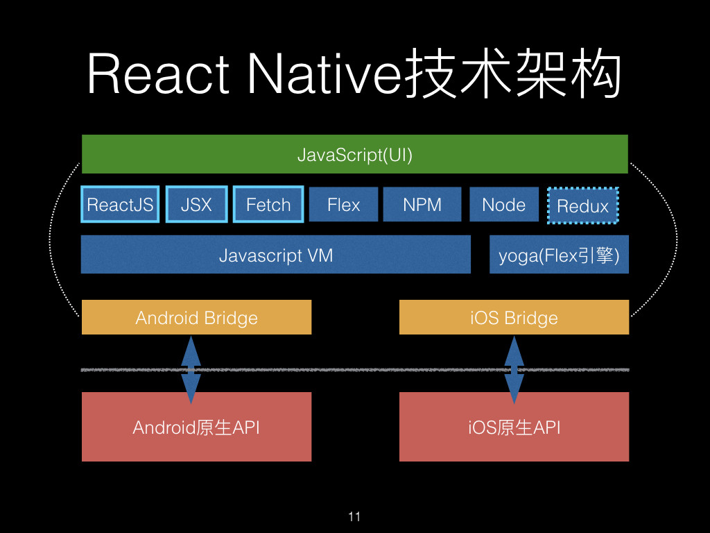

# RN 的技术架构

图中白线上方属于 React Native。

首先，所有的 JavaScript 脚本都由浏览器里面的 JS Engine 来解析执行，因为种种原因，浏览器里面的 JavaScript 代码（包括 React）是不允许调用自定义的原生代码的，所以标准的 HTML/CSS 之外的事情（调用原生控件，驱动声卡显卡，读写磁盘文件，自定义网络库等等），React 做不到。也就是说，React 由浏览器来驱动，浏览器不让你干啥你就不能干啥。

而 React Native 扩展了 JS Engine，通过 Bridge 给 React Native 内嵌的 JS Engine 提供原生接口的扩展，使它具备强大的本地资源和原生接口调用能力。RN 代替浏览器驱动 JS Engine 解析执行 JavaScript 代码，然后把计算好的结果直接返回给 Native code，Native code 根据 JS 计算出来的结果驱动设备上所有能驱动的硬件。也就是说，在 RN 这里，JavaScript 代码已经摆脱浏览器的限制，可以调用所有原生接口。同时，它不由浏览器去绘制，只计算出绘制指令，最终的绘制还是由原生控件去负责，保证了用户的原生体验。

React Native 中 JS 模块和 Native 模块分隔非常清晰，Bridge 会负责管理原生模块和对应 JS 模块之间的沟通。（Bridge 内部封装了 JavaScriptCore 框架）

也就是说，H5 的内容和布局是 HTML 和 CSS，JavaScript 负责交互；RN 是 JavaScript 发出指令，由 native 去绘制。

所以其实 RN 就是 JSX 写的，底层调用 native 接口。
