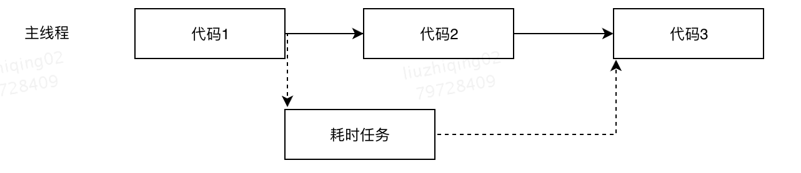

# 基础
## JavaScript如何工作？
> 关键词：V8引擎、单线程、回调队列<br>

+ V8引擎由两个主要部件组成：
    - 内存堆（menmory heap）- 内存分配地址的地方
    - 调用堆栈（Call Stack）- 代码执行的地方
+ 运行时（Runtime）： 有些常用的API是浏览器提供而不是引擎，比如DOM（document）、AJAX（XmlHttpRequest）、Timeout（setTimeout）等，称为web api。
+ 调用栈： JS是一种单线程编程语言，这意味着它只有一个调用堆栈，一次只能做一件事。
    - 调用栈是一种数据结构，记录了程序中的位置。运行到某个函数时，就会把它放在栈顶，当从这个函数返回时就会将这个函数从栈顶弹出，这就是调用栈所做的事。
    - 每一个进调用栈的被称为调用帧。
    - 堆栈溢出：当你达到调用栈最大的大小时就会发生调用栈溢出。主要都是因为递归等回调地狱造成。很多时候，浏览器会有自己的处理机制，超过最大调用栈大小时会抛出错误。
+ 单线程优缺点：
    - 优点： 避免了多线程的复杂场景例如死锁，以及多处修改dom结构等场景。
    - 缺点： 是任务耗时长时浏览器会无响应，多任务及并发问题。
+ 并发与事件循环：
    - 当调用堆栈有函数要执行时，浏览器实际上不能做其他任何事情了--它被阻塞了。如果函数执行时间过长就会造成卡顿，甚至会报错，询问你是否想终结当前web页面。
+ 什么是JIT？
    - JIT，just in time，是一个编译器
    - 是指程序逻辑以代码（或字节码）的形式下发到目标机（客户端）上，在系统即将运行此逻辑的前一刻，目标机上的编译器才将这些代码翻译成机器指令，然后再交给系统执行。
    - 因为他的编译发生在运行的前一刻，刚刚好能赶上，所以叫做Just In Time编译器。
+ 注意：js是单线程语言，这是为了避免复杂性，是语言核心特征，将来也不会改变，所以浏览器只分配给一个主线程。但为了利用多核CPU的计算能力，H5提出了 web worker标准，允许js创建多个线程，但子线程完全受主线程控制且不能操作dom，所以这个新标准并没有改变js是单线程的本质。

### 0. JS原型、原型链、继承
+ 原型：每一个构造函数（对应的就是类函数）都有一个prototype属性（强调下是属性），这个prototype属性会指向一个原型对象（强调下是对象）。该原型属性指向的原型对象称之为原型。
+ 原型链：每一个构造函数的原型属性会链式指向原型对象，每个原型对象都会有个constructor属性会指向构造函数（未定义时默认指向构造函数）其中形成了一种链式结构，我们称之为原型链。
+ 继承：（5种：原型继承、构造继承、实例继承、组合继承(call/apply继承)、ES6的class extends继承）
    - 原型继承：原型继承的原理是直接让子类的原型对象指向父类实例，当子类实例找不到对应的属性和方法时，就会往它的原型对象，也就是父类实例上找，从而实现对父类的属性和方法的继承。
    - 借用构造函数继承：
    - 实例继承：
    - call/apply继承（组合继承）：
    - 寄生式组合继承：
    - class extends继承：

### 1. 前端模块化规范
### 2. TypeScript
### 3. New操作符的原理
### 4. 闭包的作用和原理
    + 什么是闭包：首先，闭包是个函数。他有权访问另一个函数作用域内的变量。
    + 作用：1、闭包能够在函数外使用函数作用域内的局部变量；2、并且不会污染全局。
    + 原理：基于词法作用域链和垃圾回收机制，通过维持函数作用域的引用，让函数作用域可以被当前作用域外被访问到。（作用域链就是在当前执行环境下，访问某个变量时，如果不存在时，就一直往外层找，终点是全局作用域，形成一个链条就是作用域链）
    + 应用：
        1. 最简单的应用，实现自加函数；
        ```js
            function addFn() {
                let val = 0;
                return function() {
                    console.log(val++);
                }
            }
            const add = addFn();
            add(); // 0
            add(); // 1
            add(); // 2
        ```
        2. 回调函数的本质就是闭包。定时器、事件监听器、防抖节流、ajax请求、跨窗口通信、web worker或任何的异步/同步任务中，只要使用了函数回调，就都是使用了闭包。
    + 缺点：会影响垃圾回收机制，造成内存消耗，使用闭包不当时会造成内存泄漏。
### 5. ES5、ES6区别，以及其分别如何实现继承（JS原型链）
    + ES5: ECMAScript5，第五次修订，2009年完成标准化。
    + ES6: ECMAScript6，第六次修订，2015年完成标准化。
    + ES6新增的一些特性：
        1. let声明变量、const声明常量，两个都是块级作用域。而ES5中的var则是有变量提升的（变量可以先使用后定义，先使用的值为undefined）
        ```js
            //变量提升的问题
            var tem=new Date();
            //函数f 输出tem   var命令会发生“变量提升”现象  
            //局部变量优先高于全局变量 var tem="hello word" 变量提升会覆盖var tem=new Date();
            //同时你先使用为定义  所以值为undefined
            function f(){
            //即变量可以在声明之前使用，值为undefined 
                console.log(tem);
                if(false){
                    var tem="hello word"
                }
            }

            f()   //输出undeifined
        ```
        2. 箭头函数： ES6使用不再使用关键字function定义函数，转而使用箭头函数 ()=> 来定义。
        3. 模版字符串： 
### 6. JavaScript异步编程
   #### 同步与异步
    在 JS 中，通常代码按顺序从上到下同步执行，但某些特殊场景/操作下需要以异步的方式执行，即将代码划分为至少两部分，先执行一部分代码，在进行耗时操作时将主线程的执行权交出，执行其他代码，待耗时任务完成后以一定规则触发使得另一部分代码被继续执行，主要流程如下图所示。

    

        JS 中常见的异步执行场景：网络请求（Ajax 等）、定时器（SetTimeout 等）、IO 操作（readFile 等）...

        对于 JS 的这些异步场景，有两个重点：

        > 1.得知异步任务何时结束，以便进行后续操作；

        > 2.处理多个异步任务按顺序执行/并发执行的场景；

        在处理 JS 异步场景方法的衍化过程当中，逐步出现了几种方式：

        - 回调函数

        - 事件监听

        - 发布订阅

        - Promise

        - Generator/yield

        - Async/await

    ## 回调函数

    JS 中最常见的处理异步问题的方法，将任务结束时要做的事（或者说必须拿到异步任务的结果才能进行的操作）包装成函数作为参数传递给异步操作，待异步操作结束后执行函数，称之为“回调”函数。如 SetTimeout 函数就接受一个函数参数作为回调函数，在指定延迟时间后执行该回调函数：

    ```js
    setTimeout(function(){//延迟100ms后执行“代码块”；延迟即视为异步操作，代码块则是异步操作结束后的“回调函数”；
        //代码块
    }，100);
    ```

    > 回调函数的异步方法简单易理解，但不利于代码维护，尤其在多个异步任务继发执行使得回调函数嵌套的情况下，代码耦合度高不利于代码的阅读和维护，且每个任务只能指定一个回调函数。此外它不能使用 try catch 捕获错误，不能直接 return。

    > > 虽然回调函数这种方式问题很多，但是不可否认的是在 ES6 之前，他就是处理异步问题普遍较好的方式，而且后面很多方式仍然基于回调函数。

    ## 事件监听

    JS 中关于 DOM 操作的一系列监听事件也属于异步方法，如监听各种元素的 onclick、onload 等方法。只有当监听元素对应的事件被发生时对应的代码才会被执行。

    回调函数与事件监听的区别：

    - 回调函数多是一对一的关系，事件监听可以是多对一。

    - 运行异步函数，在一个不确定的时间段之后运行回调函数；不确定何时触发事件，但是触发事件同步响应事件的回调。

    - 事件监听相对于回调函数，可配置的监听（可增可减）关系减少了耦合性。

    - 不过事件监听也存在问题：

    - 多对多的监听组成了一个复杂的事件网络，单个节点通常监听了多个事件，维护成本很大。

    - 多个异步事件仍然还是回调的形式。

    ## 发布订阅

    和事件监听非常类似的是发布/订阅者模式，在事件监听的基础上，假定存在一个 " 消息中心 "，某个任务执行完成，就向消息中心 " 发布 "（publish）一个消息，其他任务可以向消息中心 " 订阅 "（subscribe）这个消息，从而知道什么时候自己可以开始执行。（直观产品就是微信的公众号模式）

        发布订阅模式在事件监听的基础上增加消息中心的概念，使得多个监听事件的运转流程和消息传递更加有序。但与事件监听相同的是发布订阅者模式也是“事件驱动”型，无法预知到事件何时发生/发布。

    ## Promise

    Promise 的三种状态：pending（进行中），fulfilled（已成功），rejected（已失败），其状态只能从进行中到成功或者是失败，不可逆。而当 Promise 成功/失败/发生错误时可以调用不同的回调函数来处理不同的情况。当状态定型后称为 resolved(已定型)，为了方便表述，后续所有 resolved 统一只指 fulfilled 状态，不包含 rejected 状态。基本使用方法如下：

    ```js
    let promise1 = new Promise((resolve, reject) => {//传入resolve和reject两个函数(自带，名字也随意)来改变Promise的状态
    //一顿操作
    if(/*异步操作成功*/){
        resolve('success'); //调用resolve函数使Promise状态从pengding=>fulfilled,reject则相反；
    }else{
        reject('reject');
    }
    //还可以操作，promise状态变化后仍会继续执行代码，但原则上不应该，因此可以用return resolve();的方式避免该情况；
    });
    promise1.then(//then方法是在Promise结束(成功/失败)后进行调用，可以传入两个回调函数作为参数分别对应成功/失败的状态；
    value => {//回调函数的参数(此为value)则是Promise状态转换时传递出的信息，resolve("success")中的“success”；
        console.log(value);
    },
    reason => {//then方法的第二个回调函数为可选；
        console.log(reason);//reject
    }
    )
    ```

### 7. 数组操作：push/pop/unshift/shift concat/reverse/sort/slice/splice
+ push: 向数组末尾添加一个或多个元素，并返回新数组长度（注意是数组长度）
+ pop：删除数组最后一个元素，并返回该元素（注意是删除的元素）
+ unshift：向数组头部添加一个或多个元素，并返回新数组长度（注意是数组长度）
+ shift：删除数组开头的第一个元素，并返回该元素（注意是删除的元素）

+ concat：连接两个或多个数组并返回新数组
    - [1,2].concat([3,4]); // [1,2,3,4]
    - [1,2].concat([3,4],[5,6]); // [1,2,3,4,5,6]

+ reverse：反转数组中元素
    - [1,2,3].reverse(); // [3,2,1]

+ sort：对数组中的元素进行排序
    - [1,3,2].sort(); // [1,2,3]
    - ['a', 'c', 'b'].sort(); // ['a', 'b', 'c']

+ slice：截取数组元素，返回一个新的数组，两个参数start和end，包含start不包括end. 第一个参数是 必需。规定从何处开始选取；第二个参数，可选。规定从何处结束选取
    - 注意该方法不会改变原数组
    - [1,2,3,4,5].slice(2,4); // [3,4]

+ splice：通过删除或替换现有元素或者原地添加新的元素来修改数组，并以数组形式返回被修改的内容。此方法会改变原数组。
    - 注意该方法会改变原数组
    - 三个参数：array.splice(start[, deleteCount[, item1[, item2[, ...]]]])
        - start：指定修改的开始位置（从0开始），如果超过了数组长度，则从数组末尾开始添加内容。如果是负值，则表示从末尾开始往前添加（从-1开始计数）
        - deleteCount：表示要移除的数组元素的个数。如果 deleteCount 大于 start 之后的元素的总数，则从 start 后面的元素都将被删除（含第 start 位）。如果 deleteCount 被省略了，或者它的值大于等于array.length - start(也就是说，如果它大于或者等于start之后的所有元素的数量)，那么start之后数组的所有元素都会被删除。如果 deleteCount 是 0 或者负数，则不移除元素。这种情况下，至少应添加一个新元素。
        - item1，item2...：表示要添加进数组的元素，从start开始。如果不指定，则splice将只删除数组元素。
        - [1,2,3].splice(1, 0, 'a'); // [1,'a',2,3]
        - [1,2,3].splice(1, 1, 'a'); // [1,'a',3]

### 8. delete操作符
+ 从MDN的这个介绍我们可以知道，delete操作符一般是用于对象的，它是用来删除对象上的属性的；而你使用了delete操作符之后，并不是立刻就会释放这个属性的引用，它只是把这个属性和这个对象解除绑定
+ delete操作符可以删除对象的属性，但删除不了原型链中的变量
    - `let a = { a: 1}; delete a.a; console.log(a.a, a)` // undefined, {}
+ delete无法删除变量、无法删除常数的变量
+ 