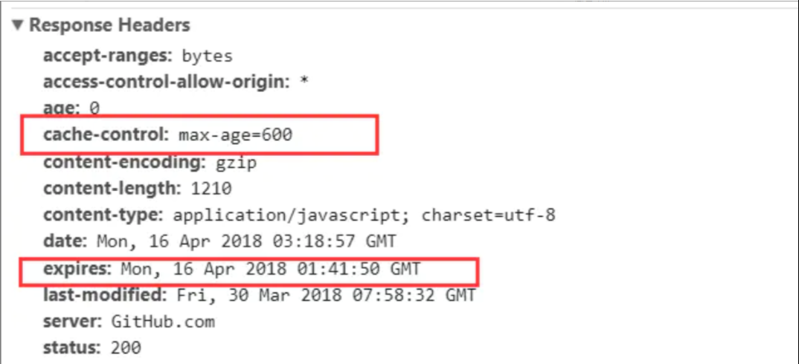

# 前端缓存

## 一、前言

前端缓存主要分为 HTTP 缓存和浏览器缓存。

HTTP 缓存是在 HTTP 请求传输时用到的缓存，主要是在服务器端代码上设置。

浏览器缓存则是主要在前端开发 js 上进行设置。也就是客户端缓存

缓存也是性能优化中简单高效的一种方式了。

## 二、HTTP 缓存过程

浏览器与服务器端的通信方式是应答模式，也就是浏览器发起请求-服务器响应该请求。

浏览器第一次发起请求拿到结果后，会根据响应报文中 HTTP 头部的缓存标识来决定是否缓存结果，是的话则将请求结果和标识存进浏览器缓存中。

### **流程**

- 1、浏览器第一次发起请求
- 2、先从浏览器缓存中查找有无该请求的缓存结果和缓存标识
- 3、没有则返回浏览器然后向服务器发起 HTTP 请求
- 4、服务器返回请求结果和缓存规则
- 5、浏览器按照缓存规则，将请求结果和缓存标识存入浏览器中，完成请求

### **三级缓存原理：**

- 1、先去内存看，如果有，直接加载
- 2、如果内存没有，选择硬盘存取，如果有则直接加载
- 3、如果硬盘也没有，那么就进行网络请求
- 4、加载到的资源存到硬盘和内存，下次请求可以快速从内存获取

## 三、强制缓存

`强制缓存` 就是向浏览器查找该请求的结果，并根据该结果的缓存规则来进行决定是否使用缓存的过程，强制缓存主要有三种：

- 1、不存在该请求的缓存结果和缓存标识，强缓存失败，直接向服务器发起请求（与第一次发起请求一致）
- 2、存在缓存结果和缓存标识，但缓存结果已失效，强缓存失败，`使用协商缓存，使用该缓存标识发起http请求`
- 3、存在缓存结果和缓存标识，且未失效，强缓存成功，直接返回该结果

### 强制缓存的缓存规则

当浏览器向服务器发起请求时，服务器会将缓存规则放入 HTTP 响应报文头中和请求结果一起返回给浏览器。

控制强缓存的字段为 `Expires`，`cache-control`，其中 cache-control 优先级比 expires 高。

- 1、expires

  > `是http1.0控制缓存的字段，其值为服务器返回该请求结果缓存的到期时间，` 再次发起请求时，如果客户端的时间小于 Expires 的值，则直接使用缓存结果。后来被 cache-control 取代的原因是`expires控制缓存的原理是使用客户端的时间与服务器做对比，也就是说这要求客户端和服务器端时间必须一致，但有时候时区不同总会造成时间不准确，所以这样很容易导致强缓存失败`

- 2、cache-control
  > 是 http1.1 中控制网页缓存的字段，主要取值为
  >
  > > - public: 所有的内容都会被缓存（客户端和服务器都可缓存）
  > > - private： 所有的内容只有客户端可以缓存，cache-control 的默认值就是 private
  > > - no-cache： 客户端缓存内容，但是是否使用缓存规则需要经过协商缓存来验证决定
  > > - no-store： 所有内容都不会被缓存，既不是用强缓存也不实用协商缓存
  > > - max-age=XXX(XXX is numberric)： 缓存内容将在 XXX 秒后失效

看个例子：

1、HTTP 报文中 expires 值是一个绝对值

2、HTTP 响应报文中 cache-control 为 max-age=600，是一个相对值

由于 cache-control 优先级比 expires 高，则直接根据 cache-control 的值进行缓存，也就是 600 秒之内再次发起请求，则直接使用缓存结果，强缓存生效。

`了解强缓存的过程之后，进一步思考：浏览器的缓存放在哪里呢，如何在浏览器中判断强制缓存是否生效呢？`

图中显示，状态码为灰色的请求代表使用了强制缓存，请求对应的 size 值，则表示了该缓存存放的位置，分别为 from memory cache、from disk cache，其中 from memory cache 代表使用了内存中的缓存，from disk cache 代表使用了硬盘中的缓存，浏览器的读取顺序为 memory->disk->服务器请求。

- 内存缓存(memory cache): 内存缓存具有两个特点，分别是速度快和时间限制。
- 硬盘缓存(disk cache)：直接将缓存写入硬盘文件中，读取时需要对存放内存的硬盘文件进行 IO 操作，然后重新解析该缓存内容，读取复杂，速度比内存缓存慢很多。

所以浏览器中，会在 js 和图片等文件解析执行后直接存入内存缓存中，那么当刷新页面时，只需要直接从内存中读取，而 css 文件则会存入硬盘文件中，所以每次渲染页面都需要从硬盘读取缓存

## 四、协商缓存

`协商缓存就是强缓存失效后，浏览器携带缓存标识向服务器端发起请求，由服务器根据缓存标识决定是否使用缓存的过程。` 主要有以下两种情况：

### 1、协商缓存生效，返回 304

### 2、协商缓存失效，返回 200 和请求结果

同样的，协商缓存的标识也是在相应的报文头中和请求结果一起返回给浏览器的，控制协商缓存的字段：last-modified/if-modified-since、Etag/if-none-match

- last-modified：是服务器响应请求时，返回该资源文件在服务器中最后被修改的时间

- if-modified-since: 是客户端再次发起请求时，携带上次请求返回的 Last-Modified 值，通过此字段告诉服务器该资源上次请求返回的最后被修改时间。服务器收到该字段后，将其时间与服务器中该资源最后更改的时间做比对，若服务器资源最后修改时间大于 If-Modified-Since 的字段值，则重新返回资源，状态码为 200；否则返回 304，标识该资源无更新，可以继续使用缓存文件。

- etag: Etag 是服务器响应请求时，返回当前资源文件的一个唯一标识(由服务器随机生成)

- if-none-match: If-None-Match 是客户端再次发起请求时，携带上一次请求返回的唯一标识 Etag 值，通过此字段告诉服务器该资源上次请求返回的唯一的标识值。通过比对请求头中的 If-None-Match 与服务器中的 Etag 值，一致返回 304；不一致重新返回资源文件，状态码 200

优先级：etag/if-none-matach 大于 last-modified/if-modified-since

## 五、HTTP 缓存总结

### `两种缓存缺陷以及最佳解决`

- 强缓存

  存在资源已经更新，但是缓存未失效，导致使用的还是缓存而不是最新的资源

- 协商缓存

  最大的问题是每一次都要接受一次验证有效性，似乎省事，但是不管那么多，先问是否有效，就很闲的蛋疼，每次都要去请求服务器，还要缓存干嘛？(气话，返回 304，无请求结果数据传输还是挺好的，就是不那么好)

- 最佳解决

  缓存的意义就是减少请求，更多使用本地资源，给用户更好的体验的同时，减轻对服务器的压力。

  **所以最佳实践就是，尽可能命中强缓存，同时能在更新版本时让客户端的缓存失效**

  综上所述，方案之一就是：

  - JS、CSS、图片： 使用强缓存，文件名带上 hash 值
  - HTML 使用协商缓存

## 六、浏览器缓存

### 1、本地存储小容量

- cookie：主要用于存储用户信息，cookie 的内容可以在自动请求时被传给服务器。
- localStorage：数据一直存在于浏览器内，直到用户清除浏览器缓存为止，所以关闭标签页是不会清除的。
- sessionStorage： 属性与 localStorage 相同，只是生命周期不同，他会在标签页关闭时被清除。

### 2、本地存储大容量

WebSql 和 IndexDB 主要用于前端 有大容量储存需求的页面上，例如在线编辑浏览器或者网页邮箱等。

### 3、往返缓存

往返缓存又称为 BFCache， 是浏览器 在前进后退 按钮上 为了提升 历史页面的渲染速度的一种策略。
该策略具体表现为：

- 当用户前往 新页面时，将当前页面 的浏览器 DOM 状态保存到 bfcache 中；
- 当用户点击后退按钮时， 将页面直接从 bfcache 加载，节省网络请求的时间。
